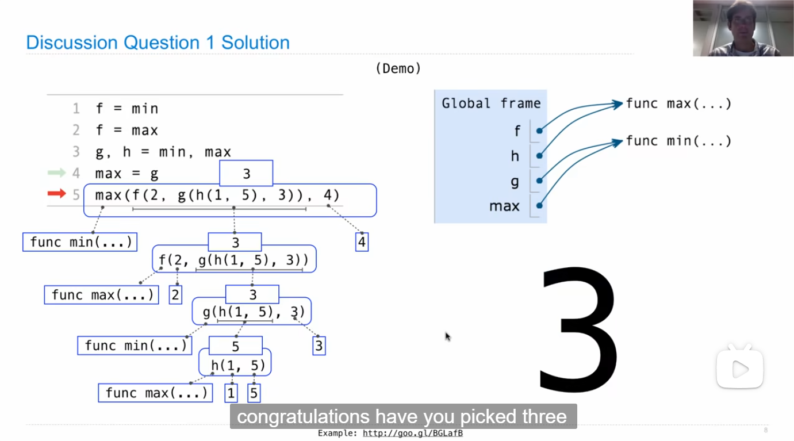
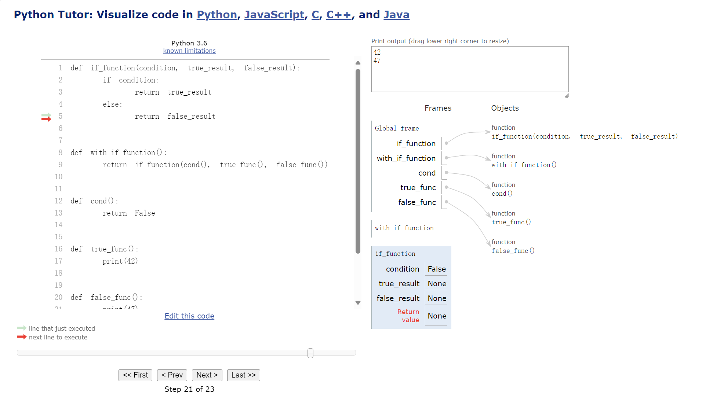

# Functions

导入内置的pi值：

```py
>>> from math import pi
>>> pi
3.141592653589793
```

为`radius`变量赋值，定义了`area`, `circ`的计算方法

```py
>>> radius = 10
>>> area, circ = pi * radius * radius, 2 * pi * radius * radius
>>> area
314.1592653589793
>>> circ
628.3185307179587
```

然而当我们改变`radius`的值后，`area`仍为314

```py
>>> radius = 20
>>> area
314.1592653589793
```

这说明`area`只是绑定了314这个值，至于这个值是怎么来的它并不清楚，也就是说他们是不同步的，想要让他们同步，我们就需要函数来实现:

```py
>>> def area():
...     return pi * radius * radius
...
>>> area
<function area at 0x0000014E574FB920>
>>> area()
1256.6370614359173
```

现在，如果我们改变`radius`的值，`area`就会随之改变

补充：课堂小问题的解答



## hw01

### Q3: Two of Three

```python
def two_of_three(x, y, z):
    """Return a*a + b*b, where a and b are the two smallest members of the
    positive numbers x, y, and z.

    >>> two_of_three(1, 2, 3)
    5
    >>> two_of_three(5, 3, 1)
    10
    >>> two_of_three(10, 2, 8)
    68
    >>> two_of_three(5, 5, 5)
    50
    >>> # check that your code consists of nothing but an expression (this docstring)
    >>> # a return statement
    >>> import inspect, ast
    >>> [type(x).__name__ for x in ast.parse(inspect.getsource(two_of_three)).body[0].body]
    ['Expr', 'Return']
    """
    return _____
```

此题中让我们求出三个数中最小的两个数的平方和，需要思考的点就是如何提取出第二小的数。我的想法是用`sorted`函数将三个数排序，此时取出下标为1的数即可：

```py
return min(x, y, z) ** 2 + sorted([x, y, z])[1] ** 2
```

不过在Hint Video中我看到了更好的思路，其实只需要用三个数的平方和减去最大数的平方即可：

```py
return x ** 2 + y ** 2 + z ** 2 - max(x, y, z) ** 2
```

### Q5: If Function vs Statement

```py
def if_function(condition, true_result, false_result):
    """Return true_result if condition is a true value, and
    false_result otherwise.

    >>> if_function(True, 2, 3)
    2
    >>> if_function(False, 2, 3)
    3
    >>> if_function(3==2, 3+2, 3-2)
    1
    >>> if_function(3>2, 3+2, 3-2)
    5
    """
    if condition:
        return true_result
    else:
        return false_result

def with_if_statement():
    """
    >>> result = with_if_statement()
    47
    >>> print(result)
    None
    """
    if cond():
        return true_func()
    else:
        return false_func()

def with_if_function():
    """
    >>> result = with_if_function()
    42
    47
    >>> print(result)
    None
    """
    return if_function(cond(), true_func(), false_func())

def cond():
    "*** YOUR CODE HERE ***"

def true_func():
    "*** YOUR CODE HERE ***"

def false_func():
    "*** YOUR CODE HERE ***"
```

这个题困扰了我许久，起初一直不明白为什么调用`with_if_function`会出来两个值，直到我想起课程中提到的用树的视角去分析函数调用的过程：

在调用`if_function(cond(), true_func(), false_func())`时，要先计算`cond()`, `true_func()`, `false_func()`，所以无论condition如何，这三个函数都会被调用（这就是`with_if_function`与`with_if_statement`的区别所在）

明白了这一点，答案显而易见：

```py
def cond():
    return False

def true_func():
    print(42)

def false_func():
    print(47)
```

之后我还犹豫了一下为什么输出不是42，47，47，于是我去请教pythontutor:



原来是在调用`true_func()`等时其返回的值是None（因为我没有写return，默认返回None），此时的传参也就相当于：

```python
if_function(False, None, None)
```

如果把函数设计成这样：

```py
def true_func():
    print(42)
    return print(42)  # 返回值仍为None，这里的print也要执行


def false_func():
    print(47)
    return print(47)
```

此时结果就会是42，42，47，47