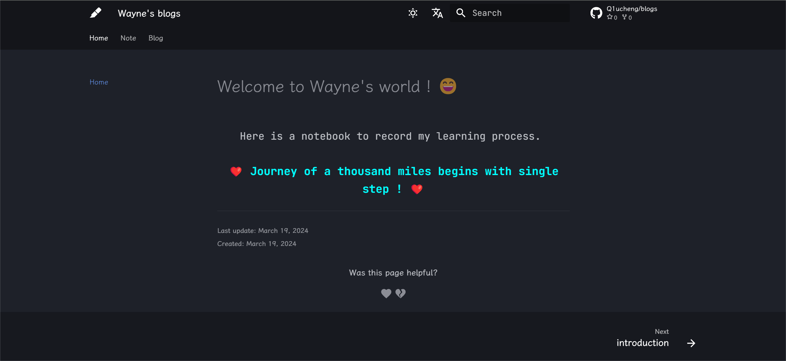

# 尝试用HTML+CSS实现首页打字效果渲染

## 起因

翻阅了几个同为`mkdocs-material`主题搭建的个人博客，发现有一些博客的主页会有一些官方文档中没有定义的效果（[Wcowin's Web](https://wcowin.work/)），于是我也想把博客的首页丰富一下（之前的首页只有一句话，太过单调😂）

## 寻找编写方式

在查看对应网页的源代码后，发现它的首页并不只是单纯用`markdown`语言编写，而是应用了`HTML`以实现更多样的自定义效果。前往作者的Github仓库中查看对应`index.md`文件：

> - **找到对应部分：**
>
> - ```html
>   “循此苦旅 以达星辰” <script 		 src="https://cdnjs.cloudflare.com/ajax/libs/animejs/2.0.2/anime.min.js"></script> 正在加载今日诗词.... <script src="https://sdk.jinrishici.com/v2/browser/jinrishici.js" charset="utf-8"></script>
>   ```
>
> - 开始直接CV试验了一下他的效果，但失败😭，应该是`src`部分的导入有问题，还不太明白，有时间重新看看

查阅资料的过程中发现，`src`部分实际上是引入了外部的包，这样来看我应该可以自己编写一个文件来实现这个“导入”。Chatgpt告诉我可以**用`css`文件来实现网页的渲染**（联想到之前修改字体的时候也是编写了一个`css`文件，确信😆），于是开始实践

## 确定方向继续编写

想起JetBrains Mono字体官网首页上的打字效果（我似乎对JetBrains的任何东西都有一种莫名的好感🤔），我也准备设置一个：

> - **灵感来源：**[JetBrains Mono 字体官网](https://www.jetbrains.com/lp/mono/)
> - **参考链接：**[纯CSS实现打字动画效果](https://www.zhangxinxu.com/wordpress/2019/01/css-typewriter-effect/)

我先是在`./stylesheets`文件夹中新增了一个`test.css`文件，在其中写入如下内容：

```css
.wrapper {
  height: 10vh;
  display: flex;
  align-items: center;
  justify-content: center;
}
```

该部分用于渲染区域的定义：

> - `height: 8vh;`：设置容器的高度为视口高度的 8%。这将确保容器在不同设备上具有一定的高度。
> - `display: flex;`：将容器设置为弹性布局，使其内部的元素可以使用弹性盒模型进行排列。
> - `align-items: center;`：在交叉轴上（垂直方向）居中对齐容器内部的元素。
> - `justify-content: center;`：在主轴上（水平方向）居中对齐容器内部的元素。

接下来根据参考链接编写定义打字效果的部分：

```css
.typing {
  width: 30em; height: 1.5em;
  border-right: 1px solid transparent;
  animation: typing 5s steps(37, end), blink-caret .75s step-end infinite;
  font-family: JetBrains Mono;
  font-size: 22px;
  word-wrap: break-all;
  word-break: break-all;
  overflow: hidden;
}

@keyframes typing {
  from { width: 0; }
  to { width: 30em; }
}

@keyframes blink-caret {
  from, to { border-color: transparent; }
  50% { border-color: currentColor; }
}
```

该部分用于构建模拟打字效果：

> **`.typing` 类的样式规则：**
>
> - `width: 30em;` 和 `height: 1.5em;`：设置文本容器的宽度为 30 个字符宽度，高度为 1.5em。
> - `border-right: 1px solid transparent;`：在文本容器的右侧创建一个 1px 宽的实线边框，边框颜色为透明。这将模拟光标的外观。
> - `animation: typing 5s steps(37, end), blink-caret .75s step-end infinite;`：定义两个动画序列并将它们应用到文本容器上。第一个动画是 `typing`，它会在 5 秒内将文本容器的宽度从 0 增加到 30em，模拟文字逐渐出现的效果。第二个动画是 `blink-caret`，它将在 0.75 秒内以 step-end 方式循环播放，使文本容器右侧的边框透明度在显示和隐藏之间闪烁，模拟光标闪烁的效果。
> - `font-family: JetBrains Mono;` 和 `font-size: 22px;`：设置文本的字体为 JetBrains Mono，字体大小为 22 像素。
> - `word-wrap: break-all;` 和 `word-break: break-all;`：允许长单词在需要时被拆分成多行显示，这样可以确保文本不会超出容器的宽度，并且适应于移动设备的小屏幕。
> - `overflow: hidden;`：当文本内容超出容器尺寸时，隐藏超出的部分。

> **`@keyframes` 规则：**
>
> - `typing` 动画定义了从 `from` 到 `to` 的过渡，使文本容器的宽度从 0 逐渐增加到 30em，以模拟文字逐渐出现的效果。
> - `blink-caret` 动画定义了从 `from` 到 `to` 的过渡，并在 `50%` 时间点上切换边框颜色，使文本容器右侧的边框透明度在显示和隐藏之间闪烁，模拟光标闪烁的效果。

接下来完成对`index.md`的编写：

```html
<div class="wrapper">
    <div class="typing">
      Here is a notebook to record my learning process.
    </div>
</div>
```

结果不可行，探索了一会感觉应该是`index.md`没有读取到我编写的`css`文件，我就把`test.css`中的内容复制到之前修改字体时编写的`extra.css`中，发现现在成功了🐵，打开`mkdocs.yml`就明白了：

```yml
extra_css:
  - stylesheets/extra.css
```

**应该在配置文件中导入新建的`test.css`，这样`md`文件才能读取`css`的内容**

最后的效果（截屏看不出来😭）：




